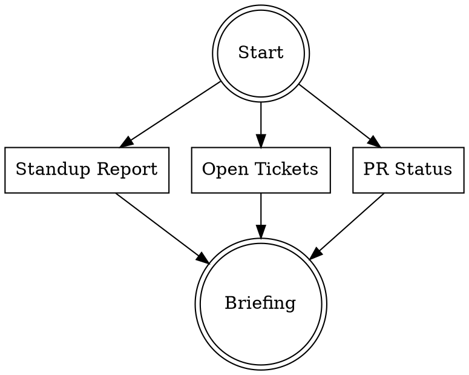

# Morning Routine

Kickstart the workday with a structured morning check-in. Run each section and present a unified briefing.

## Workflow



Run these three in parallel, then synthesize.

### 1. Yesterday's Standup Report

**REQUIRED:** Invoke the `daily-standup` skill to generate the previous workday's activity report.

### 2. Current Ticket Dashboard

Pull the user's active tickets:

```bash
# Open tickets assigned to me
acli jira workitem search \
  --jql "assignee = currentUser() AND status != Done AND status != Closed" \
  --fields "key,summary,status,priority" \
  --json --paginate
```

### 3. PR Status Check

Check for open PRs across wellsky repos that need attention:

```bash
# PRs authored by you awaiting review
gh search prs --author=@me --state=open --json repository,title,url,reviewDecision,updatedAt 2>/dev/null

# PRs where your review is requested
gh search prs --review-requested=@me --state=open --json repository,title,url,updatedAt 2>/dev/null
```

## Briefing Format

Present everything as a single morning briefing:

```markdown
# Morning Briefing — [Today's Date]

## Yesterday's Summary
[Condensed output from daily-standup skill]

## Today's Board
| Ticket | Status | Priority | Summary |
|--------|--------|----------|---------|
| PROJ-1 | In Progress | High | ... |

## PRs Needing Attention
- **Authored (awaiting review):** [list or "none"]
- **Review requested:** [list or "none"]

## Suggested Focus
- [Top 1-3 items to focus on today based on priority and status]
```

## Guidelines

- Keep the briefing scannable — this is a 2-minute read, not a deep dive
- **Suggested Focus** should prioritize: blocked PRs > high-priority in-progress tickets > new tickets
- If any data source fails (auth, network), note it and continue
- Don't ask clarifying questions — gather what's available and present it
